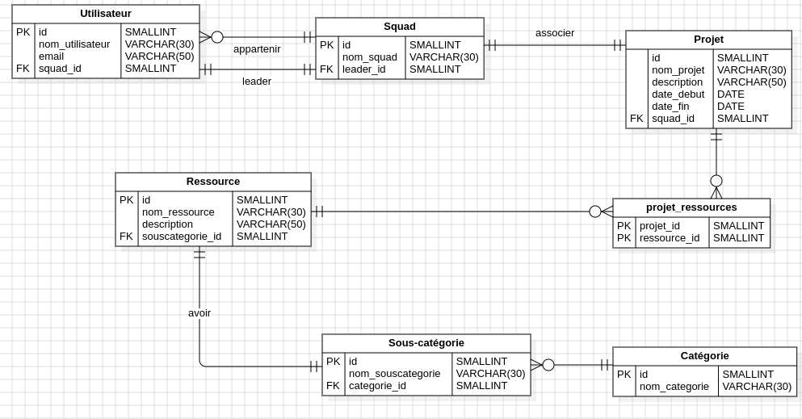

# MyResources

## Diagramme Entité-Relation (ERD)

## Diagramme de Classe

Le diagramme de classe UML offre une représentation visuelle claire de la structure de la base de données, incluant les entités, les attributs et les relations. Il facilite la compréhension de l'organisation et des propriétés des différents éléments de la base de données.

## Diagramme de cas d'utilisation

Le diagramme de cas d'utilisation UML identifie les interactions entre les acteurs (utilisateurs) et le système, décrivant les fonctionnalités offertes par le système du point de vue des utilisateurs.

## User Stories

- En tant tant que leader de squad, je souhaite créer un nouveau squad, spécifiant le nom et ajoutant des membres à ce squad, pour former rapidement des équipes dédiées à des projets spécifiques.

- En tant tant que chef de projet, je veux créer un nouveau projet en fournissant des détails tels que le nom, la description et les dates, pour définir clairement les paramètres de chaque projet.

- En tant tant que membre de squad, je veux voir la liste des projets pour lesquels mon squad est responsable pour comprendre les projets actuels et suivre les responsabilités.

- En tant tant que responsable des ressources, je veux ajouter une nouvelle ressource en spécifiant son nom, sa catégorie, sa sous-catégorie et son association éventuelle à un squad ou à un projet, pour gérer efficacement les ressources disponibles.

- En tant tant que développeur Fullstack, je veux pouvoir mettre à jour les détails d'un utilisateur, d'un squad, d'un projet ou d'une ressource existante pour ajuster les informations en fonction des évolutions.

- En tant tant que responsable des catégories et sous-catégories, je souhaite créer de nouvelles catégories et sous-catégories pour classer les ressources et organiser efficacement la base de données.

- En tant tant qu'analyste système, je veux créer un diagramme de classe UML pour représenter visuellement les entités, ainsi que leurs relations et attributs associés, pour une compréhension claire de la structure de la base de données.
